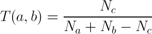

# DistanceFunctions-Golang
Machine Learning Distance Functions implementation with GoLang.

* Euclidean
* Manhattan
* Tanimoto
* HasanDist

## Euclidean Distance
Euclidean distance calculates the distance between two real-valued vectors.

You are most likely to use Euclidean distance when calculating the distance between two rows of data that have numerical values, such a floating point or integer values.

Euclidean distance is calculated as the square root of the sum of the squared differences between the two vectors.

```
EuclideanDistance = sqrt(sum for i to N (v1[i] – v2[i])^2)
```

## Manhattan Distance (Taxicab or City Block Distance)

The Manhattan distance, also called the Taxicab distance or the City Block distance, calculates the distance between two real-valued vectors.

It is perhaps more useful to vectors that describe objects on a uniform grid, like a chessboard or city blocks. The taxicab name for the measure refers to the intuition for what the measure calculates: the shortest path that a taxicab would take between city blocks (coordinates on the grid).

Manhattan distance is calculated as the sum of the absolute differences between the two vectors.
```
ManhattanDistance = sum for i to N sum |v1[i] – v2[i]|
```

## Tanimoto Distance / Jaccard

In some case, each attribute is binary such that each bit represents the absence of presence of a characteristic, thus, it is better to determine the similarity via the overlap, or intersection, of the sets.

Simply put, the Tanimoto Coefficient uses the ratio of the intersecting set to the union set as the measure of similarity. Represented as a mathematical equation



